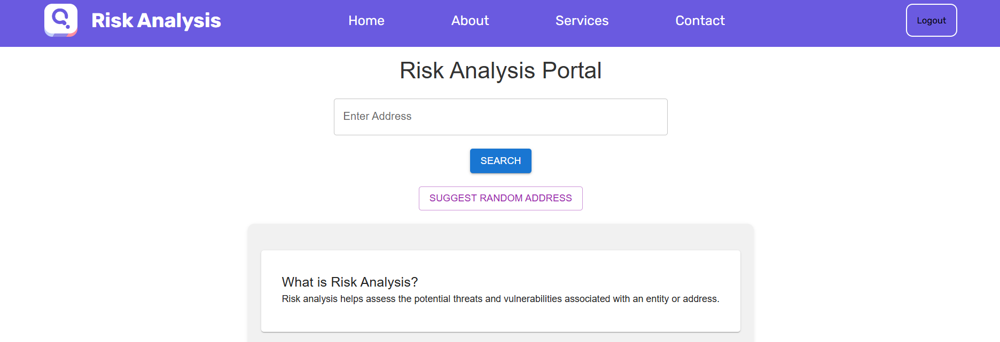
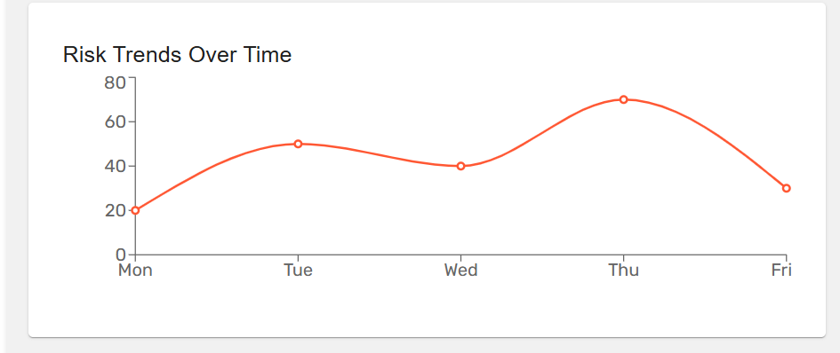
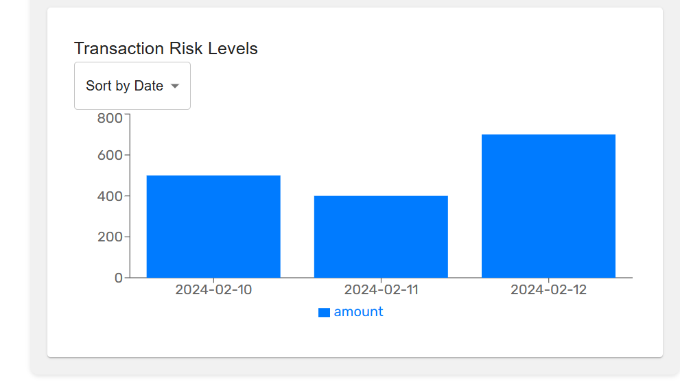
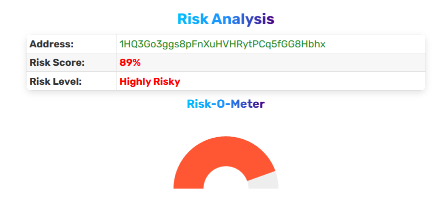
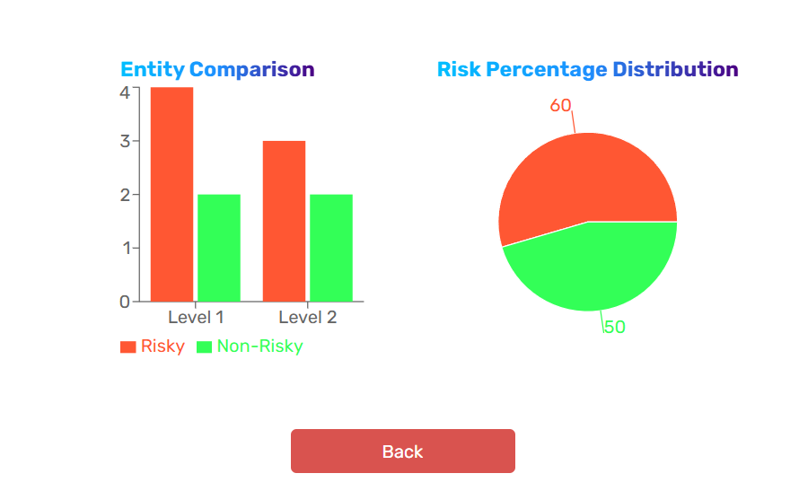

# Risk Analysis Page - React.js Assignment

## Overview

This project builds with **React.js** page where users can search for an address and receive risk analysis data. The page visually represented the risk data with engaging animations to enhance the user experience.

---

## 📌 Functionality

### 1️⃣ User Search & Data Retrieval

- Implemented a **search input** where users can enter an address.
- Upon searching, **display risk details** for that address using the provided dummy JSON data.

### 2️⃣ Risk Analysis Display

- Presented risk data in a **visually engaging** manner with animations.
- Included **charts, graphs, or a risk meter** to represent risk levels dynamically.

### 3️⃣ Data Representation

- Displayed **address, risk level, and percentage** in an intuitive format.
- Utilized animations (**Framer Motion / GSAP**) to enhance the UI experience.

---

## ⚙️ Tech Stack Guidelines

- **React.js** (Functional Components & Hooks)
- **State Management** (Redux Toolkit)
- **Chart.js / Recharts / D3.js** for risk graph representation
- **Framer Motion / GSAP** for smooth UI animations
- **Material-UI** for styling

---

## 🎯 Outcome

- A **search bar** where users input an address.
- The page dynamically update to **show the risk level and details**.
- A **risk visualization** (e.g., Risk-O-Meter, Animated Graph, or Gauge Meter).
- **Smooth UI animations** to enhance the experience.

---

<!--  -->

<table>
  <tr>
    <td></td>
    <td></td>
  </tr>
</table>

🚀 **Builded a sleek and interactive Risk Analysis Page using React.js!**

